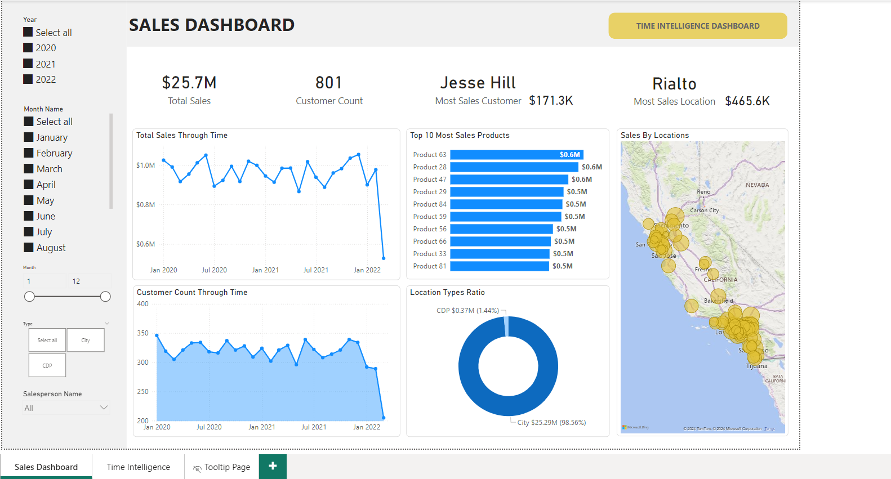
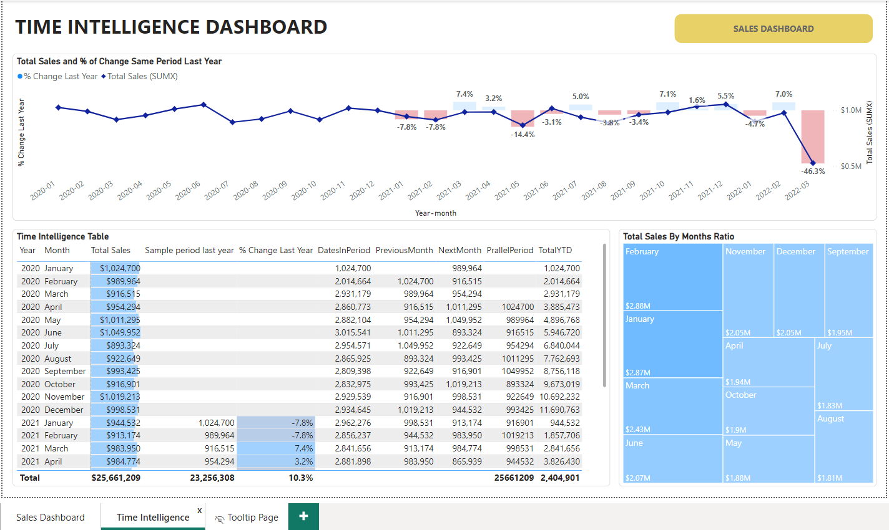
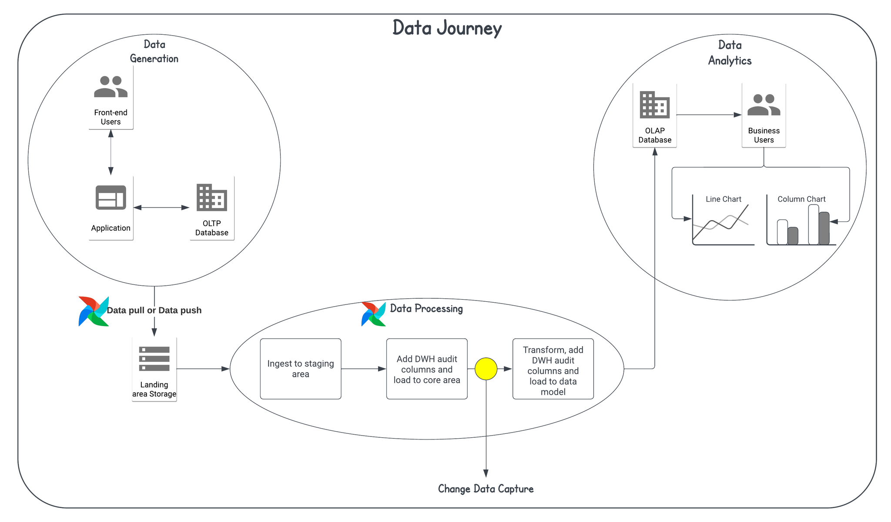
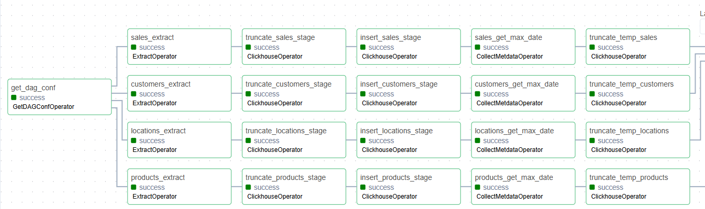
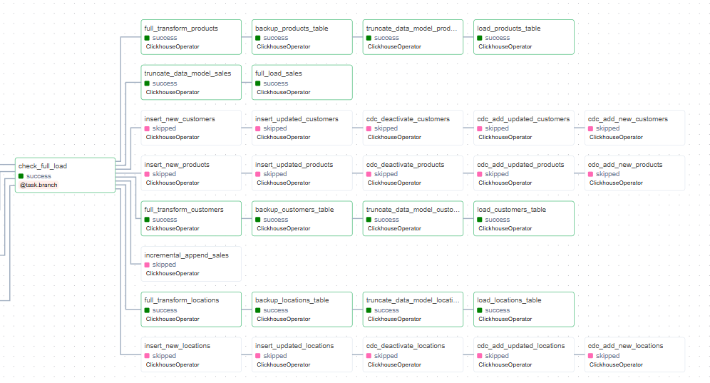

# Change Data Capture (CDC) in Airflow

## Table of Contents

- [Change Data Capture (CDC) in Airflow](#change-data-capture-cdc-in-airflow)
  - [Table of Contents](#table-of-contents)
  - [Overview](#overview)
  - [Dashboards](#dashboards)
    - [Sales Dashboard](#sales-dashboard)
    - [Time Intelligence Dashboard](#time-intelligence-dashboard)
  - [Data Pipeline Overview](#data-pipeline-overview)
    - [Pipeline Components:](#pipeline-components)
  - [Data Stack and Assumptions](#data-stack-and-assumptions)
  - [Pipeline Steps](#pipeline-steps)
    - [**1. Extract**](#1-extract)
    - [**2. Transform**](#2-transform)
    - [**3. Load**](#3-load)
  - [Airflow DAG for CDC with SCD Type II](#airflow-dag-for-cdc-with-scd-type-ii)
    - [DAG Flow](#dag-flow)
  - [Future Improvements](#future-improvements)

---

## Overview

Change Data Capture (CDC), introduced by Bill Inmon, the father of Data Warehousing, refers to the process of identifying and tracking record-level changes in operational data. CDC ensures synchronization between an Operational Data Store (ODS) and a Data Warehouse (DWH), enabling timely and accurate data for strategic decision-making. The frequency of synchronization—inter-day, intra-day, or real-time—dictates the implementation approach.

This project demonstrates a CDC process using **Apache Airflow**, synchronizing data between an **Operational Data Store (PostgreSQL)** and a **Data Warehouse (Clickhouse)**.

---

## Dashboards

### Sales Dashboard

### Time Intelligence Dashboard

---

## Data Pipeline Overview

Data generated in a source system must propagate to downstream systems like a DWH, often using batch-mode or streaming-mode pipelines. This project focuses on building a **batch-mode CDC pipeline** with the following stages:

1. **Extract**: Retrieve data from PostgreSQL.
2. **Transform**: Clean, consolidate, and prepare data for synchronization.
3. **Load**: Apply the transformed data to Clickhouse.

### Pipeline Components:

- **Source Tables**:

  - `customers`
  - `products`
  - `locations`
  - `sales`

- **Target Table**:

  - `customers`, `products`, `locations`, `sales` (consolidated as a dimension table in a Star Schema)

- **Metadata Columns**:
  Metadata columns such as `etl_start_timestamp`, `etl_end_timestamp`, `etl_current_ind`, and `etl_key` are used to track changes and maintain synchronization.

---

## Data Stack and Assumptions

| **Component**       | **Details**                                                      |
| ------------------- | ---------------------------------------------------------------- |
| **Source Database** | PostgreSQL                                                       |
| **Target Database** | Clickhouse                                                       |
| **Sync Frequency**  | Inter-day (Batch)                                                |
| **Sync Type**       | Full sync followed by daily incremental syncs using `updated_at` |
| **SCD Type**        | SCD Type 2 (preserves change history with versioning columns)    |

---

## Pipeline Steps

### **1. Extract**

- Determine load type: **Full** or **Delta**.
- Retrieve data from PostgreSQL:
  - For a full load, fetch the entire table.
  - For an incremental load, fetch data based on the `updated_at` column.
- Upload the data to cloud storage (e.g., S3).

### **2. Transform**

- Consolidate data from source tables into the target table.
- Clean and validate the data for consistency with the target schema.

### **3. Load**

- Sync the table in Clickhouse:
  - **Full Load**: Overwrite the target table with transformed data.
  - **Delta Load**: Apply CDC logic for inserts, updates, and deletes while maintaining history (SCD Type 2).

---

## Airflow DAG for CDC with SCD Type II

The Airflow DAG is modular and efficiently handles the CDC process. Key tasks include:

- **Extract**:
  - Pull data from PostgreSQL.
  - Load data into a staging schema in Clickhouse.

- **Transform**:
  - Join, clean, and prepare data for loading.

- **Load**:
  - Synchronize data with the target table using:
    - Insert operations for new records.
    - Update operations for modified records.
    - Historical tracking for SCD Type 2.

### DAG Flow

---

## Future Improvements

1. **Backfill Support**:
   - Automate backfill processes for specific DAG runs.

2. **Real-Time CDC**:
   - Enhance the pipeline for real-time synchronization.

3. **Schema Management**:
   - Implement automated schema evolution for both source and target systems.

4. **Error Handling**:
   - Add retry logic and automated alerts for failures.

5. **Enhanced Dashboards**:
   - Build more complex dashboards with advanced analytics and AI-driven insights in Power BI.

